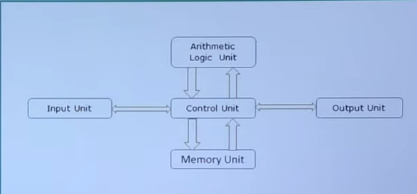
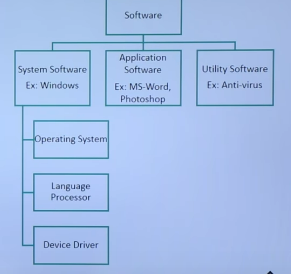

# Computer-fundamentals

## Computer Basics

- Computer is electronic device reccives the input from user store or processes the input as per users instruction and provides output.
- Computer input called as **> data**.
- Output obtained after processing data, based on users instructions is called > information.

## Data :
- Raw faccts and figures which can be processed using arithmetic and logical operations to obtain information are called as data.

1) Input Unit :  Devices use to input data and instructions from user.

2) Output Unit : Devices used to provide information to user in desire format.

3) Control Unit : All parts of computer interact through the control unit.
4) Arithmetic Logical Unit : All arithmatical and logical operation performs by it.

5) Memory : All input data, instructions and data interim to the processes are store in the menory

#### Memory are of two types.

*   Primary Memory

* Secondary Memory

6) CPU: Control unit, arithmatic logical unit and memory are together.

7. Speed : Computer carry 3-4 million instruction per sec.

## Booting : 
- Starting computers or computer embeded device is called booting.

- Booting steps 
1. Switching on power supply.
2. Loading in operating system into computers main memory.
3. Keeping all application in state of readyness.

## BIOS: (Basic Input Output System)

- The first program or set of instructions that run when computer is switch on.

1. Cold Booting : System started by switching on the power supply.
2. Warm Booting : System already in running and needs to restarted.
- All computers and computer embeded devices use microprocessor.

## Servers : 
- Server are used to provide one or more services to other system on the network.
- High processing speed.
- Can handle multiple requests simultaneously.

## Mainframes : 
- Computer used by big organisation to handle millions and trillions of online transection per second.
## Software Concept:
- A set of instruction that achive a single outcome are called program or procedure.
- Many programs functioning together to do a task make a software.
- System Software.
- Application Software.
- Utility Software.

## System Software : 